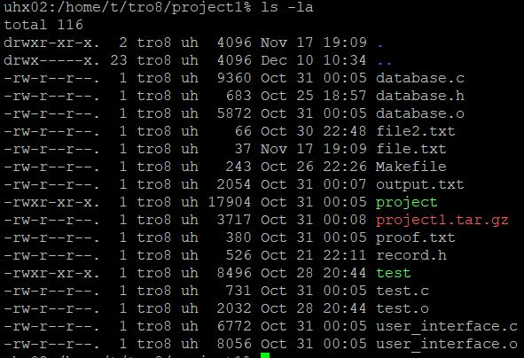

<h2>Project Overview</h2>
In ICS 212 (Program Structure) our major project for the first half of the semester was to create a banking software that would be able to add, find, print, and delete records  to and from a database in C. This included a console based user interface where the user was prompted for the action they wanted to complete. The possible commands that could be entered were: add, print, find, delete, and quit. The user could enter any of the first letters of each command and the program would carry out that command. For example the user could enter "a" or "ad" and the add function would be called.

<h2>Running the Program</h2>
If they selected add, they would then be asked for an account number, customer name, and customer address. If the user inputted anything that wasn't a positive integer for the account number, they would be prompted for one until entered. For the address field the user could have multiple blank lines and had to enter a semicolon to end the input. If the user selected print, the program would print all the records that were currently in the databse. If the user selected find, they would be prompted for an account number that would be searched for and either prints the record with corresponding account number if found or informs the user that a record with that account number does not exist. If the user selected delete they would be prompted for an account number that would be searched for and either deletes that record or informs the user that a record with that account number does not exist. The program runs and continually asks for a command until the quit command is selected, where the writefile function is called to save the records that are currently in the databse to a txt file so they don't get deleted, then the program exits. Each time the program runs, the readfile function is called to add the saved records from the txt file to the currently running program database. 

<h2>C to C++ Conversion</h2>
Our project in the second half of the semester was to convert the banking program from C to C++ and use a linked list storage structure to hold the data more efficiently. The purpose and function of the program was the same, but in ICS 212 we learned both C and C++ so we practiced by converting our major project from C to C++. One major difference was that C++ had classes which we used to create a linked list instance. There were also many simple changes like changing C functions into C++ functions. For example: get instead of fgets to get input.

<h2>Challenges and Learning Experience</h2>
Overall, the hardest part of the project was getting each function to work individually, specifically the add function. Despite the challenges it took a few weeks for the original program and a little over a week for the C++ conversion and was a great learning experience on a very simple program that has a little real world application. Through this project I learned how much work goes into even the most basic program that has only a few features.

