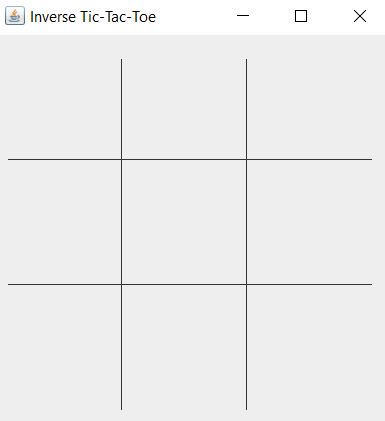

Everyone studying for a computer science or other computer related degree has to take ICS 111. This class may seem like an easy free class that everyone can pass, even without any experience in computers or programming. This class is the first computer science class that I ever took in college and it started off really easy, but towards the end of the semester the assignments started to get a little harder. The most complicated program we made in ICS 111 was probably inverse tic-tac-toe. Most people know what normal tic-tac-toe is, but the first part of the program for me was looking at the rules for the inverse version. You actually want the other person to get 3 in a row, which made the win conditions of the program a little confusing to create.

The program created a window with a tic-tac-toe board on it and had a mouse listener to see where the user clicked. Depending on the coordinates of the click, the program would draw a symbol (X or O) in the box that was clicked. The program checked for a win condition after each click and stored the symbols that were on the board using a 2D array for rows and columns. Overall, This program was a great learning experience for creating a simple game in Java.
